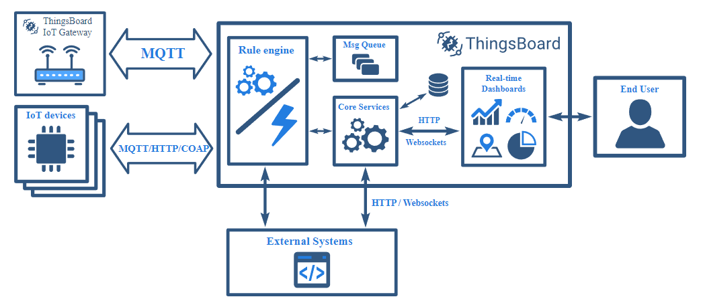

# IOT Architecture 
An IoT project where we need to emulate and manage multiple devices. Then process massive data sent from these various devices. For the project, thingsboard platforme was used. 
ThingsBoard is an open-source IoT platform for device management, data collection, processing and visualization for your IoT projects

## Emulated Devices
3 different IOT Device Types:
  1. Light Sensor: On/Off with location Sensor. Bidirectional protocol.
  - App to simulate a light light intensity and light status.
  - Sends random Data to the server every 3 seconds
  - Uses MQTT protocol
  2. Temperature & Humidity with location Sensor.
  - App to simulate temperature and humidity of a location.
  - Sends random Data to the server every 3 seconds
  - Uses HTTP protocol
  3. Fluid Sensor with location Sensor
  - App to simulate the total liquid available in litters and the consumption of said liquid in ml.
  - Sends random Data to the server every 3 seconds
  - Uses CoAP protocol

How to use:

`python3 light.py {access_code}`

This launches the app to simulate the light sensor.

`python3 temperature_humidity.py {access_code}`

This launches the app to simulate the temperature and humidity sensor.

`python3 fluid.py {access_code}`

This launches the app to simulate the fluid sensor.

## Thingsboard

### Architecture

### Device Profiles

In the thingsboard/deviceProfile/ folder, there are the various device profiles that were created for this project. One for each type of sensor. The devices created by the device profiles will automatically be set to use the network protocol set in the device profiles. The devices will also inherit alarm rules created inside the device profiles.

### Dashboards

In the thingsboard/dashboards/ folder, there are the various device dashboards that were created and used throught this project. There will be 9 different dashboards for each of the 9 devices that were registered on our thingsboard. These dashboards have multiple widgets to show the devices latest telemetries, devices alarms and the evolution of the various telemetries.

### Rule Chains

Root rule chain:

The first rule chain where every telemetry passes through. It will save the telemetry into a time series and if thats a success, it will send the various telemetries to the other rule chains designed by us to do various telemetry calculations and or just adding rules to the data.

CheckIfLiquidEmpty rule chain:

This rule chain first checks if the data has a "total" field. Then check the value of the field. if "<=" to 0, it will create a critical alarm for the device and send the telemetry to our sendEmail rule chain. If the value is above 0, it will either to do nothing or clear the previous critical alarm.

sendEmail rule chain:

This rule chain will take in the sent telemetry, create a email from the template given to the node in the rule chain and finally send out the email to the device's owner (or in our case, to maxence's email address).

FahrenheitCalculation rule chain:

This rule chain first checks if the data has a "temperature" field. If it does, it transforms the temperature value into the fahrenheit value, and finally saved that value in a timeseries for the device.

liquid_consumption rule chain:

This rule chain first checks if the data has a "consumption" field. If it does, it add to the metadata the totalConsumption telemetry data from the device. Then it will add the consumption value to the totalConsumption and save that new value as the new totalConsumption.

all_liquid_consumption rule chain:

This rule chain will add the consumption of every liquid into a value that will be saved. WIP

ml_into_l_conversion rule chain:

This rule chain will first check if the data has a consumption field. If it does, it will convert the consumption from ml to l and save that new value in a timeseries for the device.

temperature_delta_validation rule chain:

This rule chain will calculate the delta of the last ten-minutes temperature readings and the latest temperature reading. If that delta exceeds 15 degrees, it will create a critical alarm for the device. If it does not, it will either do nothing or clear the previous critical alarm.
